# 第一章 计算机网络与因特网

# 第二章 应用层

## 1.TCP

    发送和接收进程之间的可靠连接

### SSL

    位于应用层和TCP之间，提供加密的TCP连接

## 2.UDP

    发送和接收进程之间的非可靠连接

## 3.socket

每个网络应用进程都有一个属于自己的套接字，该套接字在整个因特网上独一无二。

    32位主机IP地址 + 16位端口号 = 48位套接字

## 4.http

### http 1.0
TCP传输服务（非持久性）：

    1.客户端启动TCP连接(创建套接字) 到服务器, 端口 80

    2.服务器接受来自客户端的 TCP 连接（TCP连接过程省略）

    3.http 报文(应用层协议报文) 在浏览器 (http client) 和Web服务器(http server)之间进行交换

    4.关闭TCP 连接

取对象 = 2RTTs（TCP连接+对象请求/传送）

总时间 = 2RTTs + 文件传输时间

### http 1.1

    持久性连接

### http请求报文
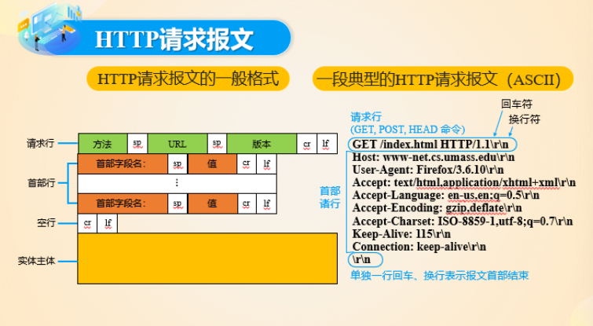

1.请求行（Request Line）：请求行包含了请求的基本信息，通常由三个部分组成：

HTTP方法：指示执行的操作，如GET、POST、PUT、DELETE等。

请求的URI（Uniform Resource Identifier）：指定请求的资源的位置。

HTTP版本：指定所使用的HTTP协议版本，如HTTP/1.1。

```
GET /example.html HTTP/1.1
```

2.首部行（Headers）：请求头包含了关于请求的附加信息，以帮助服务器处理请求。请求头通常由一系列键值对组成，每个键值对以冒号分隔，键值对之间以换行符分隔。一些常见的请求头包括：

Host：指定请求的目标主机和端口。

User-Agent：包含发起请求的用户代理（通常是浏览器）的信息。

Accept：指示客户端可以接受的响应数据类型。

Cookie：包含之前服务器发送的Cookie，以便服务器可以识别客户端。

其他自定义头部：用于传递特定的信息。

```
Host: www.example.com
User-Agent: Mozilla/5.0 (Windows NT 10.0; Win64; x64)
Accept: text/html,application/xhtml+xml,application/xml;q=0.9,*/*;q=0.8
```

3.实体主体

### http响应报文
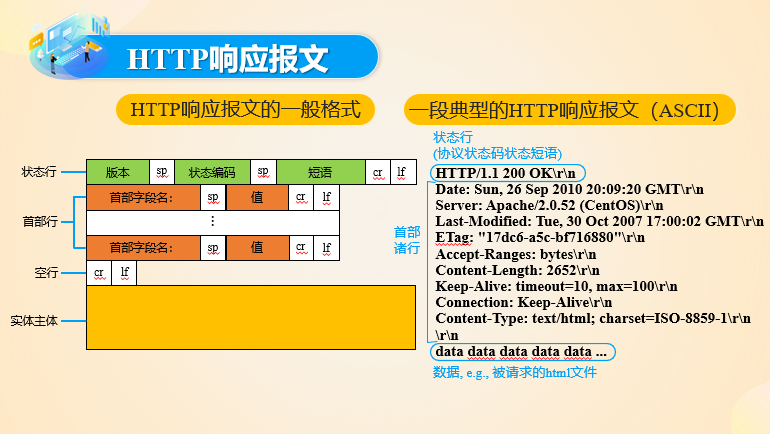

### cookie
    1.限制用户的访问

    2.把内容和用户身份关联起来

## 5.DNS
UDP协议进行报文传输

    1.在浏览器中输入www.hust.edu.cn/index.html链接，从该链接中取出www.hust.edu.cn部分，发送给DNS客户机

    2.DNS客户机向DNS服务器发送包含域名www.hust.edu.cn的查询请求报文

    3.DNS服务器向DNS客户机返回一个包含对应IP地址（202.114.0.245）的响应报文

    4.DNS客户机将获得的IP地址传送给浏览器

    5.浏览器向IP地址所在WEB服务器发起TCP链接

# 第三章 运输层

## 网络层次结构
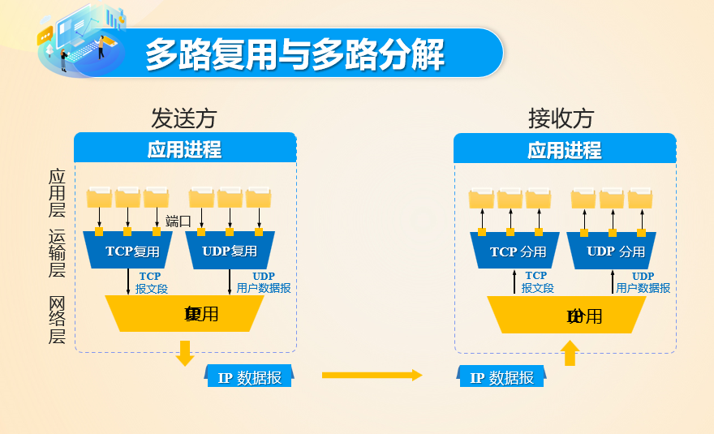

TCP报文段：

    通常，HTTP数据会被封装在TCP报文段中，以通过网络进行传输。

TCP套接字：

    包含在TCP报文段中，由一个四元组来标识（源IP地址，源端口号，目的IP地址，目的端口号）

IP数据报：

    网络层（第三层）中的数据单元。它是用于在网络中传输数据的基本单位，包含IP首部和数据部分。IP数据报负责将数据从源主机传送到目标主机，跨越网络的多个路由器和子网。IP数据报的首部中包含了源IP地址和目标IP地址，以便路由器可以将数据包正确地路由到目标主机。IP是一种无连接协议，它不提供数据传输的可靠性和顺序性。

    TCP通常在应用层的数据上构建TCP报文段，并将TCP报文段交付给网络层。

    网络层使用目标IP地址确定如何路由TCP报文段，并将它们封装为IP数据报。

    IP数据报在因特网中被路由，以便将TCP报文段从源主机传递到目标主机。

    目标主机上的网络层接收IP数据报，并将其解封装为TCP报文段，然后将其传递给应用层的目标应用程序。

UDP报文段的检查和：
将对报文段的所有数字按16比特字为一个最小单位取和（需要将进位位重新加上，进行回卷），再进行按位取反。

## 多路复用与多路分解
TCP的复用（Multiplexing）：

    在单个TCP连接中同时支持多个应用层数据流，使得多个应用程序能够共享同一TCP连接来进行通信。这可以通过使用不同的端口号来实现，其中每个端口号对应一个不同的应用程序或数据流。

举一个实际的例子：HTTP/1.1的多路复用（HTTP Multiplexing）：

    HTTP/1.1引入了多路复用的机制，允许在一个单独的TCP连接上同时发送多个HTTP请求和接收多个HTTP响应。这样，多个HTTP请求和响应可以共享同一个连接，减少了TCP连接的建立和维护开销。

    这是多路复用在HTTP/1.1中的工作方式：

    1.客户端（浏览器）打开一个与服务器的TCP连接。

    2.客户端可以同时将多个HTTP请求发送到服务器，每个请求都标识了目标资源的URL，但它们共享同一个TCP连接。

    3.服务器接收这些请求并以相同的连接将多个HTTP响应返回给客户端。

    4.客户端根据HTTP头部中的标识信息将每个响应路由到正确的应用程序（如图像加载器、CSS解析器等），这是通过多路复用实现的。

    5.多路复用使得HTTP请求的效率更高，因为它减少了TCP连接的建立和拆除开销，并允许更多资源并行加载。这在提高Web性能方面非常重要，特别是在移动设备和高延迟网络环境中。

## 可靠数据传输

### RDT1.0

### RDT2.0

#### 重传的实现

    接收方和发送方各一个报文段大小的缓冲区即可

### RDT2.1

    解决ACK/NAK出错

发送方：

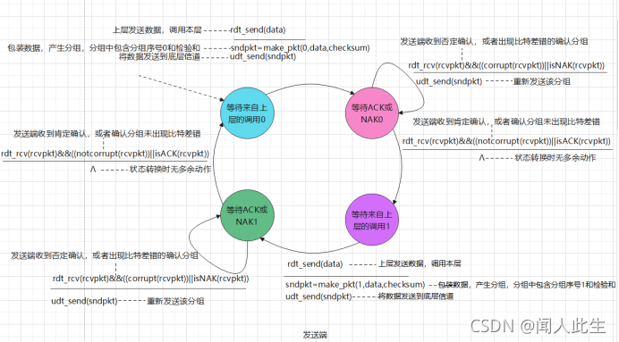

接收方：

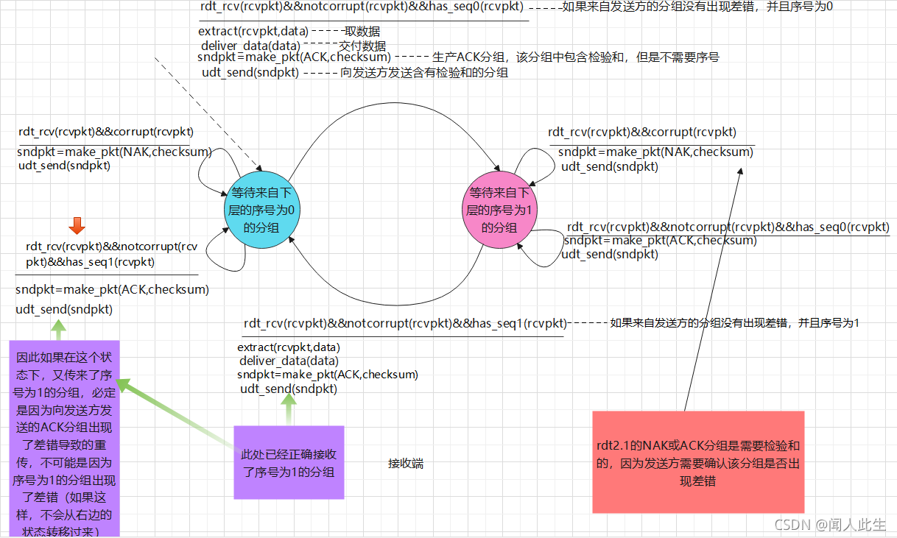

### RDT2.1与2.0的根本区别：

1.增加checksum，处理了可能存在的ACK、NAK的错误。

2.有0和1两个状态，实际上是用来区分（return = ACK && checksum = wrong）和（return = NAK && checksum = correct）两种情况下sender发送的包，否则，receiver会将情况一下的重传包多次上传。

### RDT2.1例子

1）

    sender（status = 0）发送（data，0，checknum）

2）

    receiver（status = 0） => receiver（status = 1）

    解析data上传分组至应用层

    发送（ACK，checknum）

    传输过程中出错

3）

    sender（status = 0）检查checknum = wrong

    再次发送（data，0，checknum）

4）

    receiver（status = 1）.status != 0

    不上传数据（为sender重发的分组）

    发送（ACK，checknum）

5）

    sender检查checknum = correct && ACK

    sender（status = 0） => sender（status = 1）

    即初始状态 
 
&nbsp;

从接受端的角度看：

只要接收到正确的包，就上传、改变状态、回发送信号

    若发送来的包状态符号不同，说明信号未正确传达，只做重发信号，使得发送端信号相同

    若发送来的包状态符号相同，说明信号正确传达，这是下一个包

只要接收到错误的包，就回发NAK

    发送来的一定是重传包

### RDT2.2

    取消NAK状态，引入ACK 0/1来表示

#### RDT2.2例子

第一个例子

1）

    sender（status = 0）发送（data,0,checknum）

    传输过程中出错

2）

    receiver（status = 0）检查checknum = wrong

    发送（ACK ,（~0）,checknum）


3）

    sender（status = 0）检查（checknum = wrong） || （checknum = correct && （~0））

    重发（data,0,checknum）

4）

    receiver（status = 0）检查正确

    receiver（status = 0） => receiver（status = 0）

    上传数据到应用层

    发送（ACK,0,checknum）

    传输过程中出错

5）

    sender（status = 0）检查（checknum = wrong）

    重发（data,0,checknum）

6）

    receiver（status = 1）检查1 != 0

    重发（ACK,1,checknum）

7）

    sender（status = 0） => sender（status = 1）

    即初始状态 

### RDT3.0

    解决丢包问题

#### 时间计算

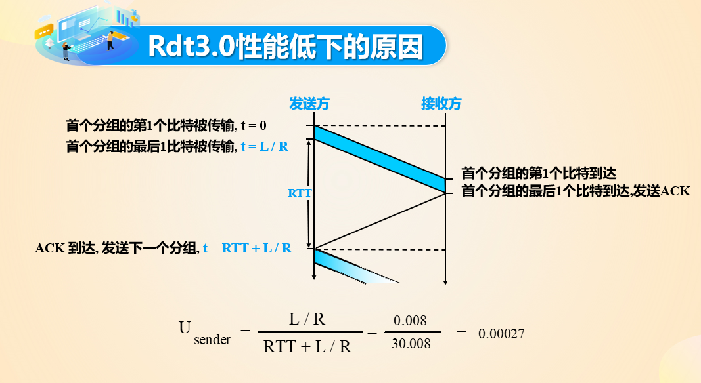

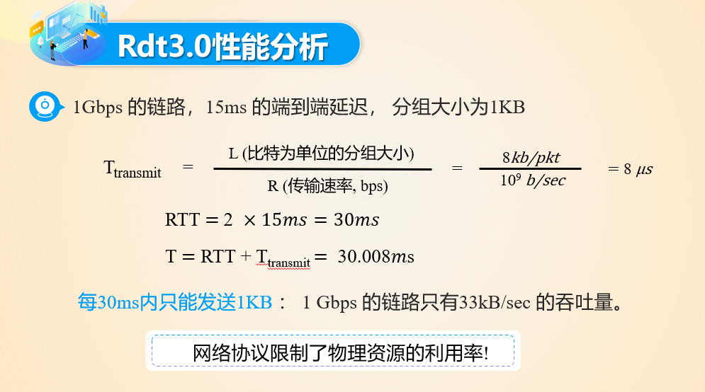

page 50

### GBN
### RS
### TCP

见实验2代码

# 网络层

## 基本作用

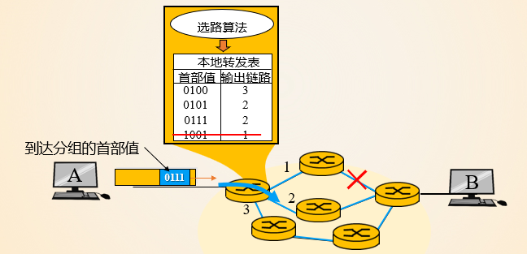

### 选路

    在全局范畴为主机之间的通信进行选路，选路的结果反映为分组交换机上的转发表。

### 转发

    分组交换机上的网络层根据转发表以及分组首部信息，将分组通过对应链路进行转发。

### 状态报告

    通过控制消息感知网络通不通、主机是否可达、路由是否可用等状态。

## 网络层选路转发服务

### 虚电路服务

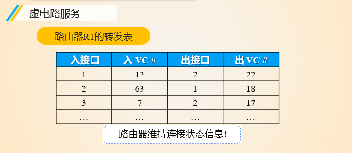

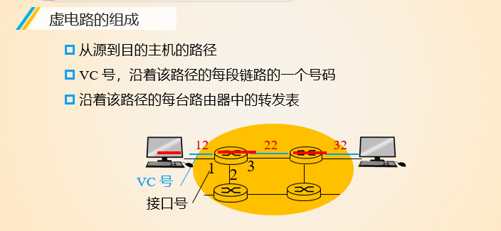

### 数据报服务

## 输出端口分组调度策略 缓存及排队策略

## 网络层组件（主机和路由器）

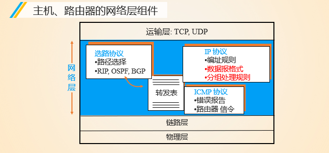

    选路协议

    IP协议：编址协议，数据报格式，分组处理规则

    ICMP协议：错误报告，路由器信令

## IP数据报格式
    1 版本（version）
    占 4 位，表示 IP 协议的版本。通信双方使用的 IP 协议版本必须一致。目前广泛使用的IP协议版本号为 4，即 IPv4。

    2 首部长度（网际报头长度IHL）
    占 4 位，可表示的最大十进制数值是 15。这个字段所表示数的单位是 32 位字长（1 个 32 位字长是 4 字节）。因此，当 IP 的首部长度为 1111 时（即十进制的 15），首部长度就达到 60 字节。当 IP 分组的首部长度不是 4 字节的整数倍时，必须利用最后的填充字段加以填充。
    数据部分永远在 4 字节的整数倍开始，这样在实现 IP 协议时较为方便。首部长度限制为 60 字节的缺点是，长度有时可能不够用，之所以限制长度为 60 字节，是希望用户尽量减少开销。最常用的首部长度就是 20 字节（即首部长度为 0101），这时不使用任何选项。

    3 区分服务（tos）
    也被称为服务类型，占 8 位，用来获得更好的服务。这个字段在旧标准中叫做服务类型，但实际上一直没有被使用过。1998 年 IETF 把这个字段改名为区分服务（Differentiated Services，DS）。只有在使用区分服务时，这个字段才起作用。

    4 总长度（totlen）
    首部和数据之和，单位为字节。总长度字段为 16 位，因此数据报的最大长度为 2^16-1=65535 字节。

    5 标识（identification）
    用来标识数据报，占 16 位。IP 协议在存储器中维持一个计数器。每产生一个数据报，计数器就加 1，并将此值赋给标识字段。当数据报的长度超过网络的 MTU，而必须分片时，这个标识字段的值就被复制到所有的数据报的标识字段中。具有相同的标识字段值的分片报文会被重组成原来的数据报。

    6 标志（flag）
    占 3 位。第一位未使用，其值为 0。第二位称为 DF（不分片），表示是否允许分片。取值为 0 时，表示允许分片；取值为 1 时，表示不允许分片。第三位称为 MF（更多分片），表示是否还有分片正在传输，设置为 0 时，表示没有更多分片需要发送，或数据报没有分片。

    7 片偏移（offsetfrag）
    占 13 位。当报文被分片后，该字段标记该分片在原报文中的相对位置。片偏移以 8 个字节为偏移单位。所以，除了最后一个分片，其他分片的偏移值都是 8 字节（64 位）的整数倍。

    8 生存时间（TTL）
    表示数据报在网络中的寿命，占 8 位。该字段由发出数据报的源主机设置。其目的是防止无法交付的数据报无限制地在网络中传输，从而消耗网络资源。
    路由器在转发数据报之前，先把 TTL 值减 1。若 TTL 值减少到 0，则丢弃这个数据报，不再转发。因此，TTL 指明数据报在网络中最多可经过多少个路由器。TTL 的最大数值为 255。若把 TTL 的初始值设为 1，则表示这个数据报只能在本局域网中传送。 

    9 协议
    表示该数据报文所携带的数据所使用的协议类型，占 8 位。该字段可以方便目的主机的 IP 层知道按照什么协议来处理数据部分。不同的协议有专门不同的协议号。
    例如，TCP 的协议号为 6，UDP 的协议号为 17，ICMP 的协议号为 1。

    10 首部检验和（checksum）
    用于校验数据报的首部，占 16 位。数据报每经过一个路由器，首部的字段都可能发生变化（如TTL），所以需要重新校验。而数据部分不发生变化，所以不用重新生成校验值。

    11 源地址
    表示数据报的源 IP 地址，占 32 位。

    12 目的地址
    表示数据报的目的 IP 地址，占 32 位。该字段用于校验发送是否正确。

    13 可选字段
    该字段用于一些可选的报头设置，主要用于测试、调试和安全的目的。这些选项包括严格源路由（数据报必须经过指定的路由）、网际时间戳（经过每个路由器时的时间戳记录）和安全限制。

    14 填充
    由于可选字段中的长度不是固定的，使用若干个 0 填充该字段，可以保证整个报头的长度是 32 位的整数倍。

    15 数据部分
    表示传输层的数据，如保存 TCP、UDP、ICMP 或 IGMP 的数据。数据部分的长度不固定。

## IP数据报拆分机制
    网络链路（MTU有限）-> 分割数据报，在目的主机重新组合。

## IP地址
    与接口有关，适用于主机、路由器内部和它们之间的物理链路和逻辑链路接口。

## 子网划分
    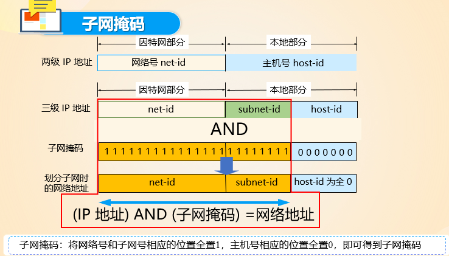

    IP地址 AND 子网掩码 = 网络地址

    对外掩饰子网的存在，对内指示网络号和子网号的位置。

    A类地址范围从1.0.0.0到126.255.255.255。

    第一个字节（8位）用于表示网络地址，其余三个字节（24位）用于表示主机地址。

    B类地址段的IP地址范围从128.0.0.0到191.255.255.255。

    B类地址使用了前两个字节（16位）来表示网络地址，后两个字节（16位）表示主机地址。

    C类地址段的IP地址范围从192.0.0.0到223.255.255.255。

    C类地址使用了前三个字节（24位）来表示网络地址，只有最后一个字节（8位）用于主机地址。这意味着C类网络支持大约256个主机。

### 一个子网划分的举例
    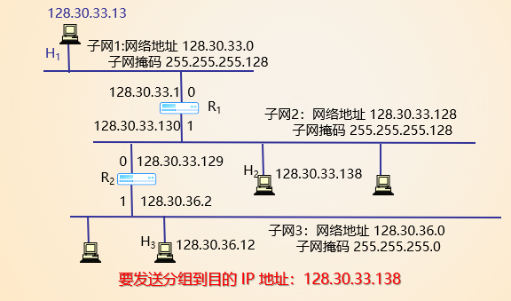
    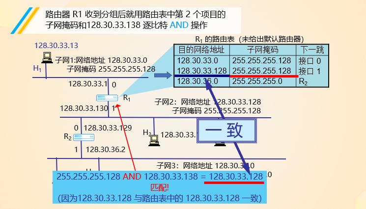
    路由器每个端口有一个独立的IP地址，通过记录的子网掩码可以找到目的网络地址。

## CIDR变址格式
    IP地址 = 地址块 + 主机号

    只给一个网络前缀和下一条地址

### 查找CIDR
    查找CIDR时，应当从匹配结果中选择具有最长网络前缀的路由：最长前缀匹配(longest-prefix matching)。

### ISP获取整块地址
    ICANN:
    分配IP
    管理DNS
    分配域名

### 域名获取
    手动分配

    DHCP
    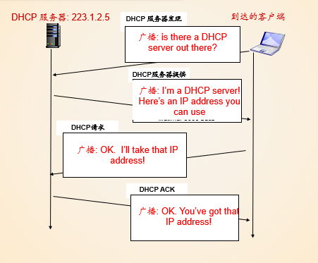

## 网络地址转换NAT
    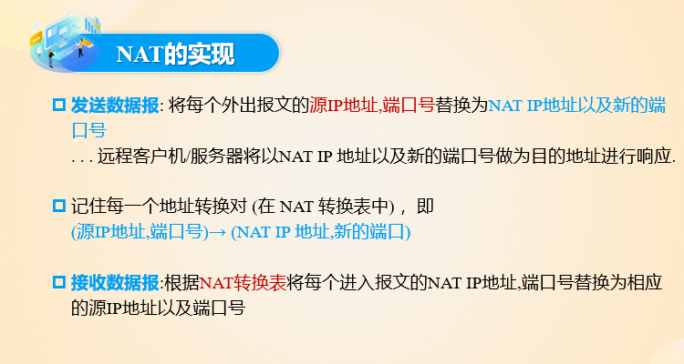

## ICMP协议